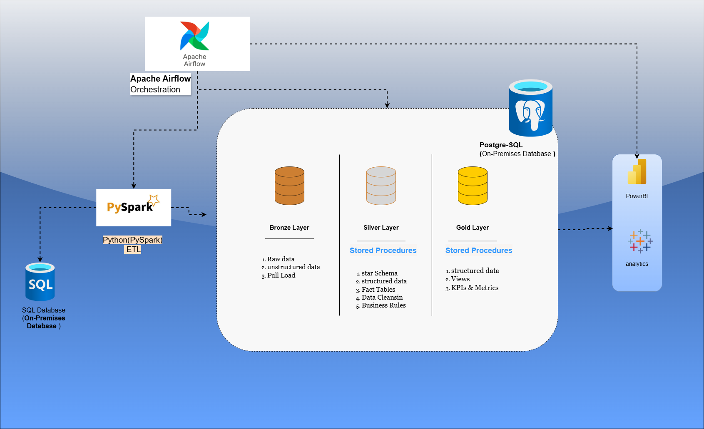
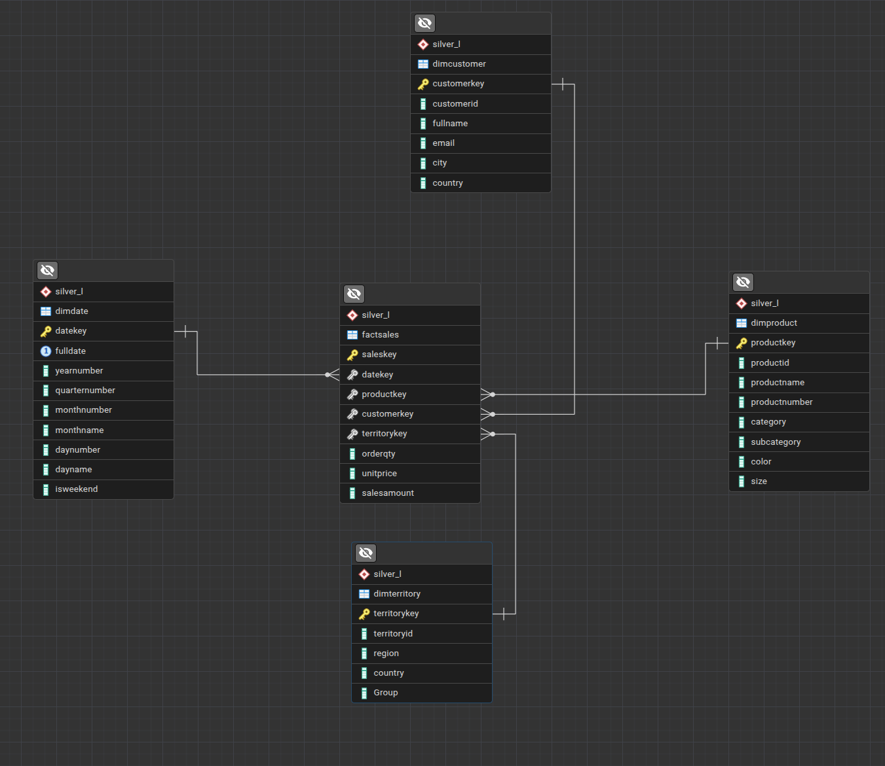

# PySpark ETL Data Marts on PostgreSQL





🚀 **End-to-End PySpark ETL pipeline** for building analytical **Data Marts** on **PostgreSQL**, following modern **Data Engineering** and **Dimensional Modeling (Star Schema)** principles.

This project demonstrates how to:
- Process data using **PySpark**
- Apply structured **ETL pipelines**
- Load curated data into **PostgreSQL**
- Build **Data Marts** optimized for analytics
- Design **Star Schema** for reporting and BI tools


---

## 🧠 Architecture Overview

The project follows a layered ETL approach inspired by modern data architectures:

Source Data (MSSQL)
↓
PySpark ETL
↓
PostgreSQL (Silver / Gold Layer)
↓
Data Marts (Star Schema)

[](https://github.com/GiorgiMegeneishvili/Data_Engineer_Project_Pyspark_ETL_dataMartsON_PostgreSQL/blob/40e5593cd23ad56b484d3def3fecc050f36b5c8e/Pyspark%20%20Diagram.png)


📌 Focus is on **clean separation of concerns**:
- ETL logic
- Configuration management
- Database procedures
- Analytical data modeling

---

## 📊 Data Modeling

The analytical layer is modeled using a **Star Schema**, optimized for BI and reporting.

### ⭐ Silver Layer – Star Schema


**Components:**
- Fact tables for measurable business events
- Dimension tables for descriptive attributes
- Foreign key relationships for analytical joins

---

## 🗂 Project Structure

Pyspark_ETL_dataMartsON_PostgreSQL/
│
├── etl/
│ ├── main.py # Entry point for ETL pipeline
│ ├── Pipline.py # Core ETL orchestration logic
│ └── init.py
│
├── Utils/
│ ├── config.py # Environment & configuration handling
│ ├── postgres_procedures.py # PostgreSQL procedure execution
│ └── init.py
│
├── diagrams/
│ └── Silver_Layer_Star_schema.png
│
├── requirements.txt
├── .env.example
└── README.md


---

## ⚙️ Technologies Used

- **Python 3**
- **PySpark**
- **PostgreSQL**
- **psycopg2**
- **python-dotenv**
- **Linux / Ubuntu**
- **Dimensional Modeling (Star Schema)**

---

## 🔐 Configuration

Environment variables are managed using `.env` file.

Create a `.env` file based on the example:

```env
PG_HOST=localhost
PG_PORT=5432
PG_DATABASE=datamart
PG_USER=postgres
PG_PASSWORD=your_password
